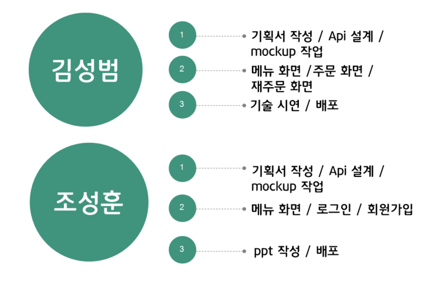

# MyCafe PROJECT

---

### 순서

- [프로젝트 배경](#프로젝트-배경)
- [팀 구성 및 역할](#팀-구성-및-역할)
- [수행 절차 및 방법](#수행-절차-및-방법)
- [설계](#설계)
- [수행 결과 및 시연](#수행-결과-및-시연)
- [개선 방안](#개선-방안)

---

## 프로젝트 배경

이 프로젝트는 카페의 주문시스템 활용을 위한 위한 웹 애플리케이션 제작입니다. 카페 내 부족한 키오스크 개수로 발생하는 대기시간을 줄이기 위해 개인 디바이스로 주문할 수 있도록 하고, 키오스크와 유사한 기능을 제공함으로 자영업자들의 키오스크 설치 비용 발생 문제를 해결할 수 있습니다. 

#### 개발환경

- Back-end: Django Rest Framework
- DB: MariaDB
- Front-end: React

---

## 팀 구성 및 역할

---

## 수행 절차 및 방법

---

## 설계

#### 스토리보드

#### DB구성

#### URLconf 설계

---

## 수행결과 및 시현

로그인 화면

로그인을 하면 주문화면으로 이동하게 됩니다.

선택된 메뉴에 따라 주문목록 화면에 표시됩니다.

주문목록에서 원하지 않는 메뉴는 (-) 버튼을 통해 제외 할 수 있도록 설정하였습니다.

주문하기 버튼을 클릭하면 Reorder page에 주문내역이 추가되도록 하였습니다. 

## 개선방안

1. 로그인/회원가입 기능
2. 기프트콘 가져오기 기능
3. 주문하기 결제시스템 연동
